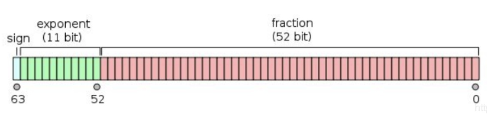

1. 语言按语法分
   1. 非形式语言
   1. 形式语言(乔姆斯基谱系)
      1. 0 型 无限制文法
      1. 1 型 上下文相关文法
      1. 2 型 上下文无关文法
      1. 3 型 正则文法
1. 产生式(BNF)

   > 参考文档：https://blog.csdn.net/lengye7/article/details/89185041
   > 只是一种表示方式，不能解析

   1. 用尖括号括起来的名称来表示语法结构名
   1. 语法结构分成基础结构和需要用其他语法结构定义的复合结构
      1. 基础结构称终结符
      1. 复合结构称非终结符
   1. 引号和中间的字符表示终结符
   1. 可以有括号
   1. \*表示重复多次
   1. |表示或
   1. +表示至少一次

   ```javascript
       // 四则运算的BNF
       //乘法表达式等于数字/等于乘法表达式乘以数字/等于乘法表达式除以数字
       <MultiplicativeExpression>::=<Number>|
           <MultiplicativeExpression>"*"<Number>|
           <MultiplicativeExpression>"/"<Number>
       //加法表达式等于乘法表达式/等于加法表达式加上乘法表达式/等于加法表达式减去乘法表达式
       <AdditiveExpression>::=<MultiplicativeExpression>|
           <AdditiveExpression>"+"<MultiplicativeExpression>|
           <AdditiveExpression>"-"<MultiplicativeExpression>
       //带括号的四则运算

   ```

1. 语言的分类
   1. 形式语言-用途
      1. 数据描述语言(JSON,HTML,XAML,SQL,CSS)
      1. 编程语言(C,C++,Java,C#,Python,Ruby,Perl,Lisp,T-SQL,Clojure,Haskell,JavaScript)
   1. 形式语言-表达方式
      1. 声明式语言(只注重结果)(SON,HTML,XAML,SQL,CSS,Lisp,Clojure,Haskell)
      1. 命令式语言(注重结果的步骤)(C,C++,Java,C#,Python,Ruby,Perl,T-SQL,JavaScript)
1. 编程语言的性质
   1. 图灵完备性(计算)
      1. 命令式-图灵机
         1. goto
         1. if 和 while
      1. 声明式-lambda
         1. 递归
   1. 动态与静态
      1. 动态:
         1. 在用户的设备/在线服务器上
         1. 产品实际运行时
         1. runtime
      1. 静态
         1. 在程序员设备上
         1. 产品开发时
         1. compiletime
   1. 类型系统
      1. 动态类型系统与静态类型系统
      1. 强类型与弱类型
         1. string+number
         1. string==number
      1. 复合类型
         1. 结构体
         1. 函数签名(包含参数类型和返回值类型)
      1. 子类型
      1. 返型 1.逆变/协变
1. 一般命令式编程语言的设计方式

   1. Atom
      1. Identifier
      1. Literal
   1. Expression(表达式)
      1. Atom
      1. Operator
      1. Punctuator
   1. Statement(语句)
      1. Expression
      1. Keyword
      1. Punctuator(标点)
   1. Structure(结构,函数)

      1. Function
      1. Class
      1. Process
      1. Namespace

   1. Program(npm)
      1. Program
      1. Module
      1. Package
      1. Library

1. 语法-》语义-》运行时

1. JS 类型

   1. Number

      > 其中涉及到二进制和十进制相互转换以及小数转二进制

      

      * 由于 JS 在存储数据的时候采取的是 IEEE754 标准。所以数据是在底层是用 64 为 01 串表示的，其中 1 位为符号位 S、11 位为指数位 E、52 位为尾数位 M(全部表示小数，默认整数部分为 1)。数据与 01 串的转化关系如下图：

      $$
      (-1)^s * 2^{(E-1023)} *(M+1)
      $$

      * 其中，最多有 53 位都表示 1 则底数最大为 1.11..1(共 53 个),指数最大为 E=2^11,因此上述公式表示的数值最大的情况是：

      $$
      (-1)^{(-1)} * 2^{(2^{11}-1023)} * 1.11...11=2^{1024} * 1.11...11
      $$

      * 0.1+0.2
         0.1 转化成二进制的数为
         $$
         0.1 = 0 * 2^{-1} + 0 * 2^{-2} + 0 * 2^{-3} + 0 * 2^{-4} + ...
         $$
         表示成指数的形式为
         $$
         2^{-4} * (1+0.1001100110011...)
         $$
         在存储 0.1 的过程中因为尾数最多只有 52 位因此造成了精度的损失
         $$
         0.2 = 0 * 2^{-1} + 0 * 2^{-2} + 1 * 2^{-3} + 1 * 2^{-4} + ...
         $$
         表示成指数的形式为
         $$
         2^{-3} * (1+0.1001100110011...)
         $$
         与 0.1 相同，存储 0.2 的过程中也因为尾数的位数限制造成了精度的损失
         按位相加时，只能存 52 位+1，因此四舍五入了
         $$
            0.11001100110011... + 1.1001100110011... = 0.0100110011001... =2^{(-2)} * (1 + 0.00110011001...)
         $$
         转化成十进制为
         $$
         2^{(-2)} + 2^{(-5)} + 2^{(-6)} + 2^{(-9)} + 2^{(-10)} +... = 0.25 + 0.03125 + 0.015625 + 0.001953125... = 0.298828125 +...=0.30000000000000004440892098500626
         $$
         由于存储和计算过程中的精度损失导致了 0.1+0.2!==0.3

   1. String

      > http://www.ruanyifeng.com/blog/2007/10/ascii_unicode_and_utf-8.html

      * 计算机内部，所有信息最终都是一个二进制值。每一个二进制位（bit）有0和1两种状态，因此八个二进制位就可以组合出256种状态，这被称为一个字节（byte）。也就是说，一个字节一共可以用来表示256种不同的状态，每一个状态对应一个符号，就是256个符号，从00000000到11111111。
      * UTF-8 最大的一个特点，就是它是一种变长的编码方式。它可以使用1~4个字节表示一个符号，根据不同的符号而变化字节长度。
      UTF-8 的编码规则很简单，只有二条：
      1）对于单字节的符号，字节的第一位设为0，后面7位为这个符号的 Unicode 码。因此对于英语字母，UTF-8 编码和 ASCII 码是相同的。
      2）对于n字节的符号（n > 1），第一个字节的前n位都设为1，第n + 1位设为0，后面字节的前两位一律设为10。剩下的没有提及的二进制位，全部为这个符号的 Unicode 码。
      * Unicode转UTF-8的例子

         |Unicode符号范围     |        UTF-8编码方式|
         |----|----|
         |(十六进制)        |              （二进制）|
         |0000 0000-0000 007F | 0xxxxxxx|
         |0000 0080-0000 07FF | 110xxxxx 10xxxxxx|
         |0000 0800-0000 FFFF | 1110xxxx 10xxxxxx 10xxxxxx|
         |0001 0000-0010 FFFF | 11110xxx 10xxxxxx 10xxxxxx |

      严的 Unicode 是4E25（100111000100101），根据上表，可以发现4E25处在第三行的范围内（0000 0800 - 0000 FFFF），因此严的 UTF-8 编码需要三个字节，即格式是1110xxxx 10xxxxxx 10xxxxxx。然后，从严的最后一个二进制位开始，依次从后向前填入格式中的x，多出的位补0。这样就得到了，严的 UTF-8 编码是11100100 10111000 10100101，转换成十六进制就是E4B8A5。
   1. 其他类型

   1. 对象的基础知识

   1. JS 中的对象
      1. property
      1. prototype
      1. Symbol:实现属性选项的权限控制，symbol 和 string 都可作为对象的键
      1. 数据属性和访问器属性
         1. Data Property：描述属性，基本类型
            1. value
            1. writable：是否可写
            1. enumerable：是否可枚举
            1. configurable：是否可编辑
         1. Accessor Property：描述行为
            1. get:读属性的时候调用
            1. set：写属性的时候调用
            1. enumerable：主要影响 Object.keys()这样的内置函数的行为和 forEach 产生的默认的行为
            1. configurable
      1. 原型机制
         > 访问属性时，如果当前对象没有，则会沿着原型找原型对象是否有此名称的属性，而原型对象还可能有原型，因此，会有原型链这一说法
         > 这一算法保证了，每个对象只需要描述自己和原型的区别即可；
      1. Object API/Grammer
         1. {}.[] Object.defineProperty(基本的对象机制，通过语法去创建对象，访问属性和定义新的属性，以及去改变属性的特征值，基本的面向对象的能力)
         1. Object.create/Object.setPrototypeOf/Object.getPrototypeOf(基于原型的描述对象的方法)
         1. new/class/extends(以基于类的方式描述对象)
         1. new/function/prototype(历史包袱，建议不用)
      1. 特殊对象
         1. Function
            > Function 是一个带 call 方法的对象，带 call 方法是一个内置行为，凡是使用双方括号来定义的都是对象的内置行为，[[call]]通过任何方式都访问不到它
            > Javascript 中的 function 关键字，箭头运算符或者 Function 构造器创建的对象，会有[[call]]这个行为
            > 用类似 f()这样的语法把对象当作函数调用时，会访问到[[call]]这个行为，如果对应的对象没有[[call]]行为，会报错
         1. 数组对象

            > 长度会随增加新的数字型这样的属性变化(不是很懂？？？？)

         1. Object.prototype

            > 所有对象的原型 Object.prototype 没有 setPrototypeOf 的方法

         1. Host Object
            > Javascript 语言标准没有定义，而是由宿主环境决定的，浏览器里可以访问到 Window，setTimeOut，跟 Javascript 原生没有任何关系
            > Host Object 可以实现 Javascript 语言不支持，但是语法支持的一些特性，可以实现 call 方法，construct 方法来支持函数调用和 new 运算
